# 个人数字资产管理完全指南

**Personal Digital Asset Management — Complete Guide**

> 四象限策略层 + AMPAS/NARA/DAM 国际标准结构层 + 三层存储架构

适用场景：20+ 块机械硬盘的整合、归档与长期保存

---

## 目录

- [第一章 四象限策略模型](docs/chapters/complete-guide.md#第一章--四象限策略模型)
- [第二章 六大核心原则](docs/chapters/complete-guide.md#第二章--六大核心原则)
- [第三章 文件夹结构规范](docs/chapters/complete-guide.md#第三章--文件夹结构规范)
- [第四章 三层存储架构与备份](docs/chapters/complete-guide.md#第四章--三层存储架构与备份)
- [第五章 老硬盘处理与数据寿命](docs/chapters/complete-guide.md#第五章--老硬盘处理与数据寿命)
- [第六章 数据拷贝与校验](docs/chapters/complete-guide.md#第六章--数据拷贝与校验)
- [第七章 自动化工具与脚本](docs/chapters/complete-guide.md#第七章--自动化工具与脚本)
- [第八章 整理行动计划](docs/chapters/complete-guide.md#第八章--整理行动计划)

## 核心内容

### 四象限分类法

将所有数字资产按两个维度分类：**重要性**与**使用频率**，形成四个象限，每个象限对应不同的存储策略。

### 三层存储架构

| 层级 | 用途 | 介质 |
|------|------|------|
| 热存储 | 当前工作 | SSD / NAS |
| 温存储 | 近期归档 | HDD / NAS |
| 冷存储 | 长期保存 | 离线 HDD / 光盘 |

### 文件夹结构

```
/Volume/
├── 01_Photo-Video/
│   └── {Year}/{YYYYMMDD-EventName}/
├── 02_Documents/
│   ├── Finance/
│   ├── Legal/
│   └── Work/
├── 03_Music/
├── 04_Design/
├── 05_Archive/
└── 06_Projects/
    ├── Active/
    └── Completed/
```

## 自动化脚本

本项目包含一套实用的自动化脚本，用于数据迁移、备份与整理：

| 脚本 | 功能 |
|------|------|
| [`rsync_smart_copy.command`](scripts/rsync_smart_copy.command) | 智能增量拷贝 |
| [`rsync_mirror_sync.command`](scripts/rsync_mirror_sync.command) | 镜像同步 |
| [`rsync_migration_guide.sh`](scripts/rsync_migration_guide.sh) | 数据迁移指南 |
| [`disk_management_toolkit.sh`](scripts/disk_management_toolkit.sh) | 磁盘管理工具 |
| [`smart_triage.command`](scripts/smart_triage.command) | 文件智能分类 |
| [`generate_info_v3.command`](scripts/generate_info_v3.command) | 硬盘信息生成 |

> 详见 [右键菜单设置指南](scripts/右键菜单设置指南.md) 了解如何将脚本集成到 macOS 右键菜单。

## 架构图

<details>
<summary>统一存储架构</summary>

</details>

<details>
<summary>事件文件夹内部结构</summary>

</details>

<details>
<summary>四象限 vs 层级结构对比</summary>

</details>

<details>
<summary>项目归档结构</summary>

</details>

## 许可证

本项目采用 [CC BY-NC 4.0](https://creativecommons.org/licenses/by-nc/4.0/) 许可协议。
